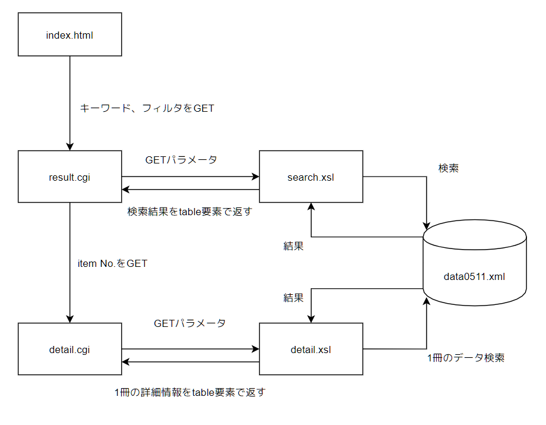
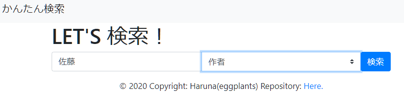
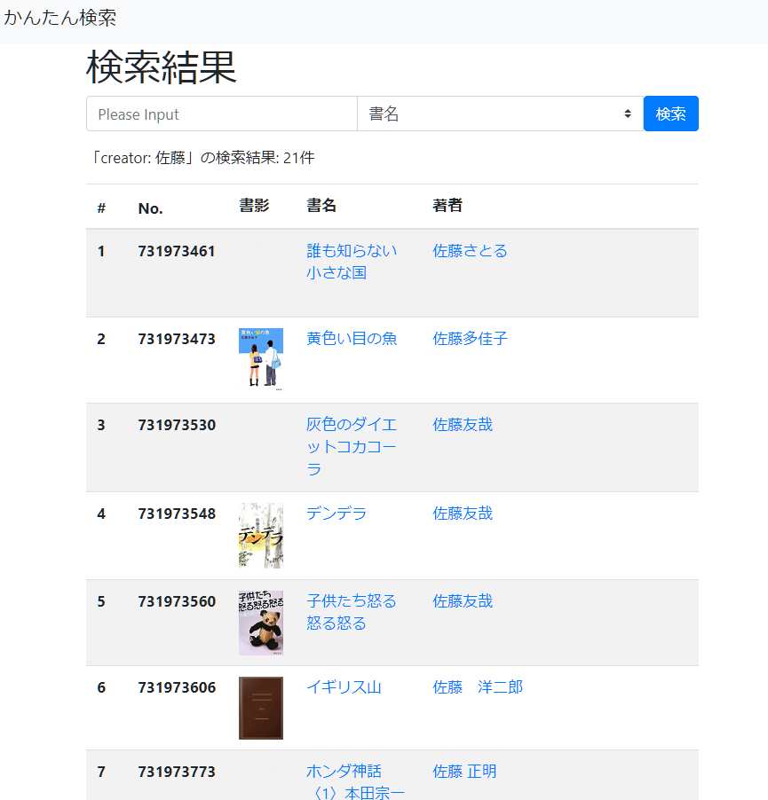
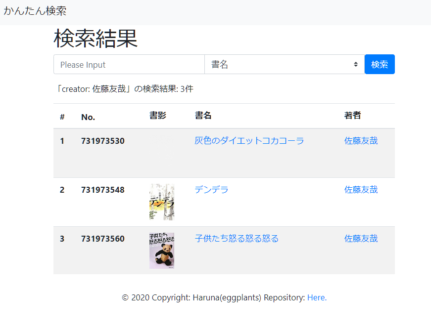
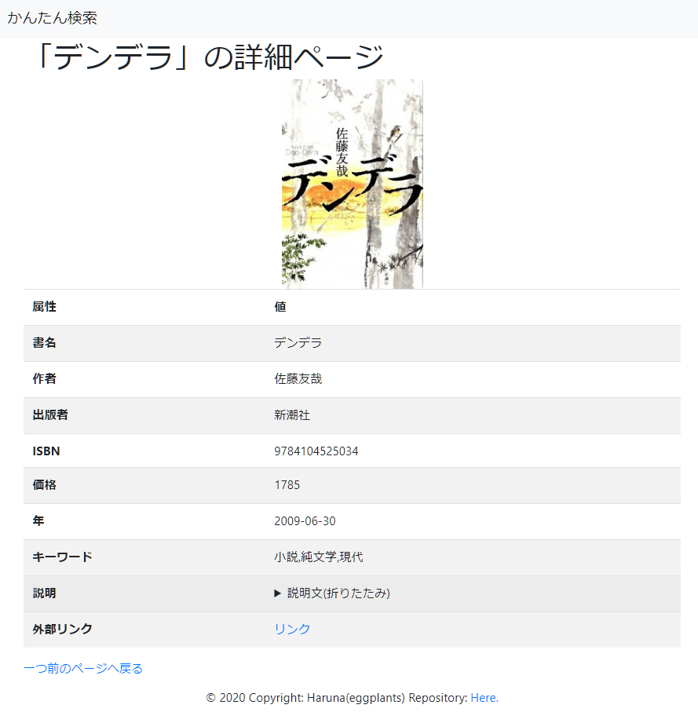

# 2020年度マークアップ言語 学期末課題

- 201811528 春名航亨 (知識情報・図書館学類)

## 0. システム図

図1: システムの全体図

## 1. 作成したXSLTスタイルシートとその解説

### search.xsl

- 概要
    -
- 工夫した点

### detail.xsl

- 概要
    -
- 工夫した点

## 2. CGIプログラムと解説

### result.cgi

- 概要
    -
- 工夫した点

### detail.cgi

- 概要
    -
- 工夫した点

## 3. ウェブブラウザで表示した実行画面とその解説

- https://cgi.u.tsukuba.ac.jp/~s1811528/unko_mark
  - 学外公開

図2: トップページ

図3: 検索結果ページ

図4: 著者選択->再検索

図5: 詳細ページ

## 4. 授業の感想

- XSLTをこの先使うことはないと思う。
- しかしXMLの形式やRubyでの処理に関しての知見が深まった。
